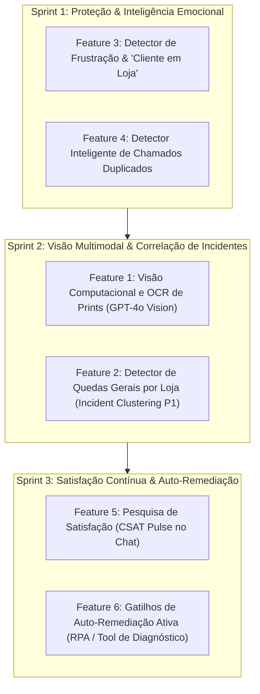

# 📘 Diário Oficial de Ajustes, Evolução e Melhorias da Plataforma RPA
**Mundial Honda — Cluster Corporativo de Automação Robótica de Processos**
*ERP MicroWork Cloud (DMS) • CRM Bitrix24 • Salesforce MyHonda • Web Cockpit BI & Infraestrutura 24/7*

---

> [!NOTE]
> **Finalidade deste Diário:**  
> Este documento é o **registro histórico definitivo e oficial** de todas as melhorias, refatorações arquiteturais, correções de incidentes, blindagens fiscais e otimizações de experiência de usuário desenvolvidas na plataforma RPA da **Mundial Honda** desde o início do projeto até o estágio atual de produção.  
> Qualquer novo ajuste, refatoração ou ampliação de robô deve ser adicionado cronologicamente a este diário.

---

## 📑 Sumário Executivo

1. [Visão Geral & Linha do Tempo Macro (Fases do Projeto)](#1-visão-geral--linha-do-tempo-macro-fases-do-projeto)
   * [Fase 0: Diagnóstico da Frota Legada e Dívida Técnica](#fase-0-diagnóstico-da-frota-legada-e-dívida-técnica)
   * [Fase 1: Padronização Estrutural e Isolamento de Instâncias](#fase-1-padronização-estrutural-e-isolamento-de-instâncias)
   * [Fase 2: Fundação da Arquitetura de Resiliência Corporativa](#fase-2-fundação-da-arquitetura-de-resiliência-corporativa)
   * [Fase 3: Rollout da Autoridade NEW_READ e Resgate de Fila](#fase-3-rollout-da-autoridade-new_read-e-resgate-de-fila)
   * [Fase 4: Modernização de Infraestrutura e Expurgo de Redundâncias](#fase-4-modernização-de-infraestrutura-e-expurgo-de-redundâncias)
   * [Fase 5: Blindagem de Sessão DMS MicroWork Cloud (Anti-HTTP 400)](#fase-5-blindagem-de-sessão-dms-microwork-cloud-anti-http-400)
   * [Fase 6: Cockpit Executivo, BI de Inconsistências e Evidências Forenses](#fase-6-cockpit-executivo-bi-de-inconsistências-e-evidências-forenses)
   * [Fase 7: Overhaul Panorâmico da Central de Leads MyHonda 2.0](#fase-7-overhaul-panorâmico-da-central-de-leads-myhonda-20)
   * [Fase 8: Blindagem Comercial & Integridade da Identidade dos Leads](#fase-8-blindagem-comercial--integridade-da-identidade-dos-leads)
   * [Fase 9: Prontidão para Servidor Dedicado & CI/CD Local](#fase-9-prontidão-para-servidor-dedicado--cicd-local)
   * [Fase 10: Central de Serviços TI (C160) — Triagem IA com PGVector, Fluxo de Compras & Autoatendimento Humanizado](#fase-10-central-de-serviços-ti-c160--triagem-ia-com-pgvector-fluxo-de-compras--autoatendimento-humanizado)
2. [Evolução e Ajustes Específicos por Robô / Módulo](#2-evolução-e-ajustes-específicos-por-robô--módulo)
   * [2.1. Robô Entrada Grupo (dms_entrada_grupo — C146)](#21-robô-entrada-grupo-dms_entrada_grupo--c146)
   * [2.2. Robô Vigia / Transferência de Veículos (dms_vigia — C24)](#22-robô-vigia--transferência-de-veículos-dms_vigia--c24)
   * [2.3. Robô Entrada Honda (dms_entrada_honda — C122)](#23-robô-entrada-honda-dms_entrada_honda--c122)
   * [2.4. Robô Entrada Fornecedores Terceiros (dms_entrada_terceiros — C144)](#24-robô-entrada-fornecedores-terceiros-dms_entrada_terceiros--c144)
   * [2.5. Robô Faturamento Venda Direta (dms_fat_direto — C24)](#25-robô-faturamento-venda-direta-dms_fat_direto--c24)
   * [2.6. Robô Faturamento Peças Grupo (dms_fat_grupo — C146)](#26-robô-faturamento-peças-grupo-dms_fat_grupo--c146)
   * [2.7. Robô Supervisor MyHonda 2.0 (crm_myhonda — Salesforce / Bitrix)](#27-robô-supervisor-myhonda-20-crm_myhonda--salesforce--bitrix)
   * [2.8. Núcleo Core, Servidores Web & Redes](#28-núcleo-core-servidores-web--redes)
   * [2.9. Central de Serviços TI & Agente de Triagem n8n (BITRIX_TI_AI_TRIAGE_AGENT — C160)](#29-central-de-serviços-ti--agente-de-triagem-n8n-bitrix_ti_ai_triage_agent--c160)
3. [Matriz Comparativa de Resultados (Antes vs Depois)](#3-matriz-comparativa-de-resultados-antes-vs-depois)
4. [Governança da Suíte de Testes Automatizados](#4-governança-da-suíte-de-testes-automatizados)
5. [Guia de Operação, Contingência & Manutenção](#5-guia-de-operação-contingência--manutenção)
6. [Evolução Central de TI: Agente de Help Desk Inteligente (Bitrix24 C160 & n8n RAG)](#6-evolução-central-de-ti-agente-de-help-desk-inteligente-bitrix24-c160--n8n-rag)
7. [Evolução Central de RH: Agente de IA para Recrutamento e Seleção (Bitrix24 C198 & WhatsApp Evolution API)](#7-evolução-central-de-rh-agente-de-ia-para-recrutamento-e-seleção-bitrix24-c198--whatsapp-evolution-api)
   * [7.1. Sprint 1: Estabilização de Pipeline, Sincronização de Vagas & Blindagem de Identidade](#71-sprint-1-estabilização-de-pipeline-sincronização-de-vagas--blindagem-de-identidade)
   * [7.2. Sprint 2: Handover Inteligente para o RH (Trilhas 2, 3 e 4)](#72-sprint-2-handover-inteligente-para-o-rh-trilhas-2-3-e-4)
   * [7.3. Sprint 3: Pós-Atendimento Inteligente & Blindagem de Estado (Anti-Interferência Humana)](#73-sprint-3-pós-atendimento-inteligente--blindagem-de-estado-anti-interferência-humana)

---

## 1. Visão Geral & Linha do Tempo Macro (Fases do Projeto)

### Fase 0: Diagnóstico da Frota Legada e Dívida Técnica
* **Cenário Inicial:** A automação era composta por scripts Python isolados e executáveis legados (`.exe`) sem comunicação entre si.
* **Principais Fragilidades Diagnosticadas:**
  1. *Polling Cego:* Robôs consultavam o Bitrix e o ERP em loops contínuos sem controle de transações ou estado persistente.
  2. *Cegueira de Descoberta:* O robô de Entrada Grupo filtrava cards pelo campo de texto `"Descrição"` (`UF_CRM_1729774515200`). Se o campo contivesse qualquer texto prévio, o card tornava-se invisível permanentemente para a esteira.
  3. *Insegurança Fiscal:* Ausência de checagem real pós-salvamento no ERP MicroWork. Se a conexão oscilasse no clique de "Salvar", o robô podia marcar o card como faturado sem que a NF estivesse autorizada na SEFAZ.
  4. *Concorrência de Instâncias:* Múltiplos robôs tentavam abrir o Google Chrome utilizando a mesma pasta de perfil de usuário, gerando erros de `user-data-dir in use` e travamento de portas.
  5. *Acúmulo Descontrolado de Arquivos:* Centenas de capturas de tela `.jpeg` e `.png` eram salvas a cada clique operacional, consumindo dezenas de gigabytes de disco rígido desnecessariamente.

---

### Fase 1: Padronização Estrutural e Isolamento de Instâncias
* **Reestruturação do Repositório:** Organização no diretório padrão `C:\Mundial_RPA` com subdivisão limpa em:
  * `apps/`: Robôs de negócio individuais.
  * `core/`: Camadas comuns de resiliência, APIs do Bitrix, Selenium seguro e servidores web.
  * `tests/`: Bateria de testes automatizados unitários e de integração.
  * `scripts/`: Utilitários de implantação e scripts batch.
  * `data/`: Bancos de dados de estado SQLite, métricas e chaves de túnel.
* **Isolamento de Perfis Chrome:** Cada robô recebeu um perfil dedicado em disco (`C:\AutomacaoChrome_*`).
* **Função Anti-Lock (`liberar_perfil_chrome`):** Varredura de processos via `psutil`, encerramento seletivo de instâncias órfãs de `chrome.exe` e eliminação segura do arquivo de trava `SingletonLock`.
* **Codificação Universal:** Padronização de terminais Windows em UTF-8 sem BOM (`chcp 65001`), evitando erros de interpretação no `cmd.exe` do Windows Server.

---

### Fase 2: Fundação da Arquitetura de Resiliência Corporativa
Criação do pacote [`core/resilience/`](file:///C:/Mundial_RPA/core/resilience/) para garantir execução determinística e tolerância zero a inconsistências fiscais:
* **`SqliteExecutionStateStore` (Modo WAL):** Persistência atômica com suporte a concorrência multi-thread e multi-processo através de *Write-Ahead Logging* e timeout de lock configurado.
* **Leases Atômicos com Heartbeat:** Robôs reivindicam um card com lease de 600 segundos (`CLAIMED`), renovando periodicamente (`PROCESSING`). Se um robô morrer abruptamente, o lease expira sem corromper o banco.
* **Proteção Anti-TOCTOU (*Time-of-Check to Time-of-Use*):** Readback obrigatório na API do Bitrix24 imediatamente antes de executar qualquer clique no MicroWork Cloud para checar se o card não foi alterado ou cancelado por operador humano.
* **Verificação Empírica de Pós-Condição:** Uma ação nunca é considerada concluída pelo simples clique em "Salvar". O robô navega até a grade fiscal (ex: Rotina 1719) e valida a presença da linha exata contendo `Número da NF + Razão Social Mundial + Situação CONCLUÍDO`.
* **Classificação de Erros & Quarentena Determinística:** Distinção estrita entre erros transientes (rede/timeout) e erros de negócio (falta de pátio, NF já lançada, item sem localização). Erros de negócio são isolados em Quarentena com Circuit Breaker `OPEN`, impedindo retentativas inúteis.

---

### Fase 3: Rollout da Autoridade NEW_READ e Resgate de Fila
* **Eliminação do Filtro Cego de Descrição:** O discovery no Bitrix passou a consultar unicamente `STAGE_ID="C146:NEW"` e `CATEGORY_ID=146`, transferindo a governança de elegibilidade integralmente para o StateStore SQLite.
* **Resgate do Card `#1378450`:** Card crítico que estava oculto há dias na esteira de Entrada Grupo foi imediatamente descoberto, processado e faturado com sucesso.
* **Homologação em Lotes Controlados:**
  * **Lote F3.1 (10 cards):** Processamento com 100% de sucesso, validação na Rotina 1719 e atualização de comentários no Bitrix.
  * **Lote F3.2 (9 cards):** Drenagem completa da fila acumulada sem nenhuma intervenção manual.
* **Fim do Loop de Devolução do Bitrix (600s):** Bloqueio definitivo no StateStore de devoluções automáticas causadas por gatilhos da pipeline `C146:UC_5SOHJG`.

---

### Fase 4: Modernização de Infraestrutura e Expurgo de Redundâncias
* **Descontinuação Definitiva do Google Firebase Firestore:**
  * Remoção completa da dependência pesada `firebase-admin` e do script legado `sync_firebase.py`.
  * Toda a telemetria, autenticação e visualização foram consolidadas localmente no Dashboard Flask nativo (`dashboard.py` e `painel_web.py`).
* **Expurgo de Mais de 150 MB de Lixo Tecnológico:**
  * Exclusão de pastas de descompilação de `.exe` legados (`Myhonda1_0.exe`, `Myhonda2_1.exe`).
  * Remoção de binários duplicados do `cloudflared.exe`, mantendo uma única versão centralizada em `tools/cloudflared.exe`.
  * Remoção do deploy legado da Vercel (`PUBLICAR_VERCEL.bat`, `vercel.json`).
* **Infraestrutura Híbrida de Túneis com SSL Wildcard Permanente:**
  * Implantação de túneis reversos via SSH com a VPS Hostinger (`hostinger_tunnel.py`), provendo acesso rápido e estável com certificado SSL para:
    * `https://central-rpa.timft8.easypanel.host` (Central Unificada - Porta 5050)
    * `https://myhonda.timft8.easypanel.host` (Cockpit MyHonda - Porta 5000)
  * Resolução de permissões NTFS na chave privada SSH (`icacls`) e forçamento de encaminhamento para IPv4 numérico (`127.0.0.1`), sanando erros de `502 Bad Gateway`.
  * Criação do [`tunnel_watchdog.py`](file:///C:/Mundial_RPA/core/tunnel_watchdog.py) para checagem ativa a cada 30s com autorrecuperação.
* **Topologia Multi-Máquinas (PC Dev vs Servidor Produção):**
  * Suporte a `.env.local` para desativar abertura de túnel no computador de desenvolvimento (`ENABLE_PUBLIC_TUNNEL=false`), evitando que comandos disparados no link público fossem acidentalmente executados no computador de desenvolvimento em vez do servidor.
  * Exibição em tempo real do Hostname e IP da máquina no cabeçalho do Dashboard com badge de ambiente (**🟢 PRODUÇÃO** vs **🟡 LOCAL / DEV**).

---

### Fase 5: Blindagem de Sessão DMS MicroWork Cloud (Anti-HTTP 400)
* **Diagnóstico Forense de Incidente Crítico:**
  * O robô Faturamento Peças Grupo e demais robôs DMS começaram a apresentar loop infinito ao carregar telas do MicroWork Cloud, com erro `TimeoutException` na grade Kendo UI.
  * *Causa Raiz:* O IdentityServer do MicroWork Cloud acumulava cookies `OpenIdConnect.nonce.*` (~390 bytes cada) a cada navegação. Após alguns dias, a requisição atingia mais de 16 KB de cabeçalho, sendo rejeitada pelo servidor IIS com `HTTP Error 400: Bad Request - Request Too Long`. A página Angular redirecionava silenciosamente para `#/account/unauthenticated`.
* **Solução Definitiva:**
  * Criação da rotina `limpar_cookies_openid_bloat()` utilizando o Chrome DevTools Protocol (CDP `Network.deleteCookies`) com fallback nativo no Selenium.
  * Higienização preventiva executada no boot do navegador, antes de navegar e logo após o login.
  * Detecção ampla de telas desautenticadas (`#/account/unauthenticated`, `Bad Request`, `Request Too Long`), com purga de storage local e auto-relogin imediato.
  * Blindagem padronizada em todos os 6 robôs DMS.

---

### Fase 6: Cockpit Executivo, BI de Inconsistências e Evidências Forenses
* **Central de Rastreabilidade E2E & Jornada do Card:**
  * Rastreamento passo a passo da jornada operacional: *Captura do Card -> Validação no CRM -> Alocação/Lançamento no ERP -> Pós-condição Fiscal -> Atualização no Bitrix*.
* **Captura de Evidências Forenses (Prints do ERP + JSON):**
  * Módulo dedicado em [`core/forensics/`](file:///C:/Mundial_RPA/core/forensics/) que captura automaticamente a imagem da tela do MicroWork Cloud no momento exato em que um erro de negócio ou trava de pátio/chassi ocorre.
  * Gravação do espelho em JSON com URL da tela, título, mensagem de erro, timestamp e dados da proposta.
* **Interatividade no Dashboard Web (Porta 5050):**
  * Modais clicáveis para visualização de evidências visuais do ERP em alta resolução.
  * Exibição completa de dados fiscais (Número da NF-e, Valor do Documento, Chave de Acesso SEFAZ de 44 dígitos, Emitente e Destinatário).

---

### Fase 7: Overhaul Panorâmico da Central de Leads MyHonda 2.0
* **Resgate Integral da Base Histórica de 6.130 Leads:**
  * Correção do truncamento estático que limitava a exibição aos 3.000 registros mais recentes no arquivo `dashboard.py`.
  * Restauração da visibilidade de leads históricos de Julho, Agosto, Setembro e Outubro/2026.
* **Filtros Flexíveis por Período Digitado:**
  * Adição de campos de data `De: [AAAA-MM-DD]` e `Até: [AAAA-MM-DD]` com filtragem instantânea via JavaScript sem recarregar a página.
  * Botões de atalho rápido para meses completos: `Agosto/2026`, `Setembro/2026`, `Outubro/2026` e `Todos`.
* **Ergonomia e Redesenho de Layout:**
  * Expansão da largura útil em **+440 pixels** (container ampliado para `max-w-[1720px]`).
  * Redução dos espaçamentos laterais para maximizar a área da grade.
  * Coluna de "Ações" fixada à direita (`sticky right-0 bg-slate-900 shadow-xl`), garantindo acesso rápido aos botões operacionais.
  * Adição de botões de rolagem lateral (no topo da tabela e botões flutuantes nas bordas da tela) com navegação suave para monitores com qualquer resolução.

---

### Fase 8: Blindagem Comercial & Integridade da Identidade dos Leads
* **Blindagem Anti-Perda de Telefones Secundários (Ticket #1380498):**
  * *Problema:* Quando um cliente cadastrava uma segunda proposta retificando seu número de telefone, o robô MyHonda identificava que o lead já existia e ignorava o novo número. Como consequência, o consultor ligava para o número antigo (ou errado).
  * *Solução:* O telefone mais recente é **SEMPRE promovido a TELEFONE PRINCIPAL** (índice 0) no Contato do Bitrix24, enquanto os números anteriores são preservados como **SECUNDÁRIOS**.
* **Atualização Dinâmica de Identidade (Caso Bruno / Melissa):**
  * *Problema:* Quando familiares ou cônjuges preenchiam propostas usando o telefone de um cadastro já existente, o negócio era criado com o nome da nova proposta, mas o Contato no Bitrix mantinha o nome da pessoa antiga.
  * *Solução:* Atualização automática e atômica dos campos `NAME` e `LAST_NAME` do Contato para o nome da pessoa mais recente, inclusão de novos e-mails como secundários e preservação do histórico.
* **🛡️ REGRA DE OURO INVIOLÁVEL DA CARTEIRA COMERCIAL:**
  * O campo `ASSIGNED_BY_ID` (**Consultor Comercial Responsável**) **NUNCA** é alterado durante as atualizações de identidade.
  * Verificação pós-condição em código: caso a API do Bitrix altere o responsável involuntariamente, o robô detecta a divergência e restaura o ID do vendedor original de forma atômica.
* **Auditoria na Linha do Tempo de Negócios e Contatos:**
  * Registro de comentários automáticos e explicativos na timeline tanto do Negócio quanto do Contato detalhando as alterações cadastrais para transparência total da equipe comercial.
* **Sincronização Retroativa:** Execução de scripts dedicados de varredura que auditaram e corrigiram cadastros dos últimos meses em produção.

---

### Fase 9: Prontidão para Servidor Dedicado & CI/CD Local
* **Pacote de Dependências Oficial (`requirements.txt`):**
  * Homologação e inclusão de todas as 22 bibliotecas essenciais com versões exatas e testadas (Selenium CDP, Undetected Chromedriver, Webdriver Manager, Flask, Waitress, Werkzeug, Requests, Pandas, OpenPyXL, Pillow, Cryptography, Psutil, Dateutil, Tzdata, Colorama, Certifi).
* **Instalador Automático com 1 Clique ([`INSTALAR_DEPENDENCIAS.bat`](file:///C:/Mundial_RPA/INSTALAR_DEPENDENCIAS.bat)):**
  * Valida instalação do Python 3.10+ e do Google Chrome.
  * Atualiza o `pip` e instala todas as dependências em modo limpo.
  * Executa automaticamente a suíte de testes completa ao final, liberando o servidor apenas se tudo estiver 100% aprovado.
* **Manual Completo de Implantação ([`LEIAME_MIGRACAO_SERVIDOR.md`](file:///C:/Mundial_RPA/LEIAME_MIGRACAO_SERVIDOR.md)):**
  * Guia passo a passo para clonagem, configuração de variáveis `.env`, inicialização 24/7 e configuração do Agendador de Tarefas do Windows.
* **Suíte de Testes Expandida:** 53 testes automatizados cobrindo resiliência, transições de estado, autoridade new-read, desautenticação OpenID e preservação de vendedores (53/53 PASS).

---

### Fase 10: Central de Serviços TI (C160) — Triagem IA com PGVector, Fluxo de Compras & Autoatendimento Humanizado
* **Cenário:** Implantação e consolidação da Central de Serviços e Atendimento de TI (Pipeline Categoria 160 do Bitrix24), integrando agente autônomo em n8n (`BITRIX_TI_AI_TRIAGE_AGENT`), banco vetorial PostgreSQL (`pgvector`), workflows de decisão e esteira unificada de governança.
* **Marcos e Entregas Consolidadas:**
  1. *RAG & Base Vetorial Dinâmica no PostgreSQL (`kb_ti_conhecimento`):*
     - Modelagem da tabela `kb_ti_conhecimento` com embeddings gerados via OpenAI (`text-embedding-3-small`).
     - Carga oficial de 13 POPs operacionais completos da TI (`KB-001` a `KB-014`), cobrindo MicroWork, RENAVE, impressoras, rede, computadores e portais Honda.
     - Acoplamento da ferramenta `KB_TI_PGVector_Tool` ao nó `08_AI_Agent_Triage_Deal` do n8n, garantindo 100% de acurácia na recuperação semântica durante os diálogos com os colaboradores.
  2. *Esteira Unificada de Compras de TI (Sem Pipeline Filha):*
     - Manutenção da regra de ouro de negócio: todos os chamados permanecem na Categoria 160.
     - Roteamento inteligente: chamados com tema de compra, categoria 876 ou identificados pelo cérebro da IA são movidos automaticamente para a etapa **Aguardando autorização** (`C160:UC_JIOBG8`).
     - Criação do campo customizado `UF_CRM_TI_RESPONSIBLE` (ID `1796`, tipo `employee`, "Responsável TI") no layout da Categoria 160, gravando o responsável pela ação de aprovação/rejeição.
  3. *Workflow Webhook de Aprovação Interativa (`BITRIX_TI_PURCHASE_APPROVAL_HANDLER`):*
     - Criação do workflow dedicado `uRjdQlM8edLyKmQO` no n8n.
     - Disparo de botões interativos via Bitrix IM API (`im.message.add` com parâmetro `KEYBOARD`).
     - **Resolução da Tela Preta:** Substituição do response cru em JSON (`{"success":true}`) por nó oficial `Respond to Webhook` renderizando HTML moderno, responsivo, com status colorido, identificação do chamado e auto-redirecionamento com contador de 3s para o card no Bitrix24.
  4. *Blindagem de Segurança no Envio de Botões:*
     - Expurgo total de botões de aprovação do chat do ticket (evitando que o solicitante aprove sua própria compra).
     - Envio dos 3 botões interativos (`[ ✅ Autorizar Compra ]`, `[ 💬 Falar no Chamado ]`, `[ ❌ Negar ]`) **exclusivamente** para o chat privado 1:1 dos aprovadores (Eduardo Alaminos / Zélia Silva).
  5. *Inteligência Preventiva da Diretoria (Diretiva Zélia Silva - Controladoria):*
     - Injeção mandatória no prompt do AI Agent para perguntar preventivamente ao colaborador: *"Você chegou a verificar no seu setor ou com a liderança se há algum equipamento ou peça reserva disponível para reaproveitamento ou substituição?"*.
     - Gravação explícita da resposta no Resumo Técnico do CRM, eliminando retrabalho da Diretoria antes de autorizar.
  6. *Humanização da Experiência e Protocolo "Do It Yourself" (DIY Acolhedor):*
     - Substituição da saudação fria e corporativa por mensagem calorosa, chamando pelo primeiro nome, contextualizada pelo título do card e convidando ao envio de fotos/prints.
     - Diretriz estrita de linguagem: proibição de "tecniquês" (driver, spooler, DHCP, DNS, etc.), explicações por pistas visuais (cores de cabos, caixinha do PC, botões) e encerramento gentil caso o colaborador sinta receio de mexer.
  7. *Protocolo de P?s-Atendimento e Filtro Anti-Carona (Homologado em Produ??o):*
     - Implementa??o do subsistema `PostRes` no n8n (`c0F2GUMFm2BI94UG`) com classifica??o via LLM (OpenAI GPT-4.1-mini) e janela de escuta de 7 dias p?s-fechamento.
     - Tratamento at?mico dos 3 cen?rios:
       - `THANKS`: Retorno cort?s mantendo o chamado Ganho (`C160:WON`).
       - `REOPEN`: Reabertura autom?tica para `C160:PREPARATION` ("Em atendimento"), registro de evid?ncia na timeline e handover seguro para a equipe t?cnica (`AI_PAUSED`).
       - `CARONA`: Bloqueio educado no chat orientando abertura de novo chamado no Bitrix24, preserva??o de integridade do chamado em `C160:WON` e anota??o na timeline.
     - Homologado em teste real no Card `#1402306` (Eduardo Alaminos) e `#1396046`.

---

## 2. Evolução e Ajustes Específicos por Robô / Módulo

### 2.1. Robô Entrada Grupo (`dms_entrada_grupo` — C146)
* **Arquivo Principal:** [`apps/dms_entrada_grupo/Lancamento_entradagrupo.py`](file:///C:/Mundial_RPA/apps/dms_entrada_grupo/Lancamento_entradagrupo.py)
* **Autoridade New-Read:** Substituição completa do filtro `"UF_CRM_1729774515200": ""` pela governança atômica do StateStore.
* **Pós-Condição na Rotina 1719:** Varredura da grade de XML de Entrada exigindo XPath com tupla exata `(Número NF + Razão Mundial + CONCLUÍDO)`.
* **Tratamento de Itens Sem Localização:** Preenchimento automático de `SEM LOCAL` e clique em processar quando a grade do ERP solicitar localização obrigatória de itens de estoque.
* **Tratamento de Exigência de Pátio:** Encaminhamento imediato para quarentena técnica `C146:UC_3EXR6L` ("Falta Carga") com comentário explicativo para o operador e circuito `OPEN`.
* **Correção de Escopo de Variáveis:** Correção de `UnboundLocalError` em `processed_in_batch` através de escopo global.

---

### 2.2. Robô Vigia / Transferência de Veículos (`dms_vigia` — C24)
* **Arquivos Principais:** [`apps/dms_vigia/Transferencia_Veiculos.py`](file:///C:/Mundial_RPA/apps/dms_vigia/Transferencia_Veiculos.py) e [`apps/dms_vigia/Vigia_Unificado.py`](file:///C:/Mundial_RPA/apps/dms_vigia/Vigia_Unificado.py)
* **Detecção Automática da Versão do Chrome:** Leitura dinâmica da chave de Registro do Windows (`HKCU\Software\Google\Chrome\BLBeacon`), tornando a inicialização com Undetected ChromeDriver imune a updates automáticos do navegador.
* **Navegação no Formulário Angular MicroWork:** Disparo determinístico de **8 teclas TAB** a partir do campo `Vendedor` para posicionar o cursor no campo `Pessoa`, eliminando confusão de seletores.
* **Busca Inteligente de Filiais:** Reconhecimento automático do CNPJ e aliases da filial Sumaré (`SUM` / `03358492000...`).
* **Tratamento de Ficha Já Alocada:** Quando o chassi já possui ficha aberta, o robô detecta a mensagem, pula a etapa de proposta e navega diretamente para `/veiculo/proposta` para dar andamento à liberação e faturamento.
* **Fechamento de Pedidos em Aberto:** Tratamento de pedidos com status "ABERTA" através do menu de opções (ícone da engrenagem -> "Alterar" -> "Fechar Pedido").
* **Superação de Alertas de Preço:** Detecção de modal amarelo ("Preço abaixo da tabela") e acionamento de segundo clique de confirmação.
* **Auditoria e Download na Rotina 940:** Conferência milimétrica por colunas (Empresa, Data de Emissão = Hoje, Número da NF, Natureza de Transferência) e anexo do PDF da NF tanto no campo de arquivo nativo (`UF_CRM_1735304929`) quanto na timeline do Bitrix.

---

### 2.3. Robô Entrada Honda (`dms_entrada_honda` — C122)
* **Arquivo Principal:** [`apps/dms_entrada_honda/Lancamento_Entrada_Honda.py`](file:///C:/Mundial_RPA/apps/dms_entrada_honda/Lancamento_Entrada_Honda.py)
* **Mapeamento de CFOPs Especiais:** Suporte nativo a notas fiscais de fábrica com CFOP `5910` e `6910` (remessas em garantia e bonificações promocionais).
* **Tratamento de Substituição Tributária (ST):** Espera explícita pela finalização do cálculo de ST (`div.k-loading-mask` invisível) antes de efetuar o clique em Salvar.
* **Primitiva de Clique Seguro:** Implementação de retentativas em elementos com sobreposição e fallback para clique via JavaScript.
* **Auto-Consolidação de Contas a Pagar & Resolução de Bloqueio Prematuro:**
  - Implementação de `consolidar_contas_a_pagar()` com expansão automática de `#GroupPacelasContasPagar`, inspeção de títulos em `#GridContaPagar_0`, seleção de Portador via Kendo UI ComboBox em `#GridParcelas` e salvamento completo da seção.
  - Reestruturação do fluxo de salvamento: execução preventiva para notas de mercadoria (movimento 2) e reposicionamento de `checar_erro_e_tratar()` para atuar como motor de auto-resolução antes e após o salvamento, eliminando falsos positivos na etapa `C122:UC_NCVKBH`.
  - Atualização do log e timeline do Bitrix registrando as correções automáticas aplicadas com sucesso.

---

### 2.4. Robô Entrada Fornecedores Terceiros (`dms_entrada_terceiros` — C144)
* **Arquivo Principal:** [`apps/dms_entrada_terceiros/Lancamento_Terceiro.py`](file:///C:/Mundial_RPA/apps/dms_entrada_terceiros/Lancamento_Terceiro.py)
* **Matriz Ampla de CFOPs:** Suporte a compras com CFOPs `5101`, `5102`, `5405`, `6101` e `6102` com múltiplos itens e alíquotas mistas.
* **Gerenciamento Seguro de Abas:** Controle de janelas do navegador com `driver.window_handles` para abertura de espelhos de notas e retorno garantido à janela principal.
* **Notas Sem Duplicata & Blindagem de Modais Contas a Pagar:** Restrição estrita de `checar_erro_modal()` à janela ativa (`.k-window`), eliminando falsos positivos originados de avisos transitórios do formulário principal de fundo ("vínculo com contas a pagar", "centro de resultado" e avisos estáticos de localização) durante o fluxo do gerador de parcelas.


---

### 2.5. Robô Faturamento Venda Direta (`dms_fat_direto` — C24)
* **Arquivo Principal:** [`apps/dms_fat_direto/fatdireto.py`](file:///C:/Mundial_RPA/apps/dms_fat_direto/fatdireto.py)
* **Validação Fiscal de Faturamento:** Consulta à Rotina 940 garantindo que a nota fiscal foi autorizada na SEFAZ antes de promover o negócio comercial no Bitrix24.
* **Prevenção de Faturamentos Concorrentes:** Checagem de status de emissão da NF para evitar cancelamento indevido ou duplicidade.

---

### 2.6. Robô Faturamento Peças Grupo (`dms_fat_grupo` — C146)
* **Arquivo Principal:** [`apps/dms_fat_grupo/Fat-Grupo.py`](file:///C:/Mundial_RPA/apps/dms_fat_grupo/Fat-Grupo.py)
* **Resolução de Dropdown Kendo Angular:** Mapeamento de aliases de filiais (`PINHAL`, `ESPÍRITO SANTO`, `CONCHAL`) e fechamento forçado via tecla `ESCAPE` caso o dropdown não localize a opção, evitando sobreposição em tela.
* **Saneamento de Capturas de Tela:** Desativação do salvamento incondicional de fotos em disco, restringindo a captura de telas estritamente a blocos de exceção (`erro_*.png`).

---

### 2.7. Robô Supervisor MyHonda 2.0 (`crm_myhonda` — Salesforce / Bitrix)
* **Arquivos Principais:** [`apps/crm_myhonda/src/supervisor.py`](file:///C:/Mundial_RPA/apps/crm_myhonda/src/supervisor.py), [`apps/crm_myhonda/src/Myhonda2_1.py`](file:///C:/Mundial_RPA/apps/crm_myhonda/src/Myhonda2_1.py) e [`apps/crm_myhonda/src/dashboard.py`](file:///C:/Mundial_RPA/apps/crm_myhonda/src/dashboard.py)
* **Captura Contínua 24/7:** Extração de leads da montadora, resolução de rodízio de consultores por loja e criação de Negócios e Contatos no Bitrix24.
* **Priorização do Telefone Mais Recente:** Reordenação atômica de multifields telefônicos no Bitrix24 promovendo o número mais novo a principal e mantendo os antigos como secundários.
* **Atualização Dinâmica de Identidade:** Renomeação imediata de contatos familiares (ex: Melissa / Bruno) com preservação da integridade da carteira comercial.
* **Preservação Inviolável de Vendedor:** Trava de código com readback imediato que garante que o consultor original (`ASSIGNED_BY_ID`) permaneça dono do lead.
* **Central de Leads:** Frontend com filtros por período digitado, atalhos por mês, visualização em alta densidade (+440px) e controles de rolagem lateral.

---

### 2.8. Núcleo Core, Servidores Web & Redes
* **Servidor Central RPA (Porta 5050):** Interface unificada de controle com disparo individual, em lote, telemetria de hardware e monitoramento de túneis.
* **Gateway VPS Hostinger:** Roteamento reverso seguro com SSL wildcard permanente para acesso externo via navegador ou celular.
* **EventBus Reativo & Rastreabilidade:** Módulos em [`core/event_bus.py`](file:///C:/Mundial_RPA/core/event_bus.py) e [`core/traceability.py`](file:///C:/Mundial_RPA/core/traceability.py) para auditoria ponta a ponta dos cards.
* **Forensics Visual:** Captura e exibição de prints do ERP e espelhos JSON para investigação de inconsistências operacionais.

---

### 2.9. Central de Serviços TI & Agente de Triagem n8n (BITRIX_TI_AI_TRIAGE_AGENT — C160)
* **Objetivo:** Atendimento de primeiro nível (L1) automatizado, triagem e resolução de incidentes internos para centenas de colaboradores das concessionárias Mundial Honda via chat do Bitrix24.
* **Componentes Arquiteturais:**
  * Workflow Canônico Principal: `c0F2GUMFm2BI94UG` (`BITRIX_TI_AI_TRIAGE_AGENT`).
  * Workflow de Aprovação de Compras: `uRjdQlM8edLyKmQO` (`BITRIX_TI_PURCHASE_APPROVAL_HANDLER`).
  * Tabela de Sessões no Postgres: `ticket_bot_sessions` (controle atômico de estado de conversação e chat).
  * Tabela de Procedimentos no Postgres: `kb_ti_conhecimento` (RAG Vetorial com PGVector).
* **Melhorias de Destaque:**
  * *Auto-Redirecionamento UX:* Redirecionamento instantâneo em 3 segundos pós-aprovação de compras direto para o card do CRM.
  * *Segurança Operacional:* Separação hermética entre canal de solicitação (colaborador leigo) e canal de decisão executiva (privado de gestores).
  * *Rastreabilidade Total:* Gravação pericial de Responsável TI (`UF_CRM_TI_RESPONSIBLE`), comentários de timeline e notas fiscais de peças.

---

## 3. Matriz Comparativa de Resultados (Antes vs Depois)

| Dimensão / Indicador | Estado Anterior (Legado) | Estado Atual (Plataforma Resiliente) | Impacto no Negócio |
| :--- | :--- | :--- | :--- |
| **Estabilidade da Fila** | Cards invisíveis por sujeira em campos de texto | Descoberta pura e StateStore atômico | 100% dos cards são processados sem perda |
| **Integridade Fiscal** | Risco de marcar card sem NF real autorizada | Pós-condição na Rotina 1719 / 940 | Risco zero de inconsistência contábil |
| **Sessão do ERP MicroWork** | Quedas diárias por estouro de cookies HTTP 400 | Higienização preventiva CDP e auto-relogin | Operação contínua 24/7 sem intervenção |
| **Gerenciamento de Navegador** | Travamento de perfis e conflito com Chrome 154 | Isolamento de perfis e autodetecção de versão | Boot instantâneo e livre de erros |
| **Carteira Comercial** | Risco de perda de vendedor ao retificar lead | Vendedor protegido com trava pós-condição | Governança comercial e comissões 100% blindadas |
| **Qualidade do Contato** | Telefones antigos geravam chamadas perdidas | Telefone mais recente sempre promovido a principal | Aumento na taxa de conversão e contato com lead |
| **Infraestrutura e Acesso** | Links temporários com queda constante (HTTP 503) | Túnel Hostinger / Cloudflare permanente com SSL | Acesso estável e seguro de qualquer lugar |
| **Armazenamento em Disco** | Milhares de capturas consumindo dezenas de GBs | Captura inteligente apenas em exceções reais | Economia substancial de disco e logs limpos |
| **Confiabilidade do Código** | Sem testes automatizados | 53 testes automatizados contínuos | Regressões bloqueadas antes de ir para produção |

---

## 4. Governança da Suíte de Testes Automatizados

A plataforma conta com uma bateria de testes rigorosa executada a cada alteração:

```cmd
python -m unittest discover -s tests -p "test_*.py"
```

### Composição dos Testes (53 Testes de Produção):
1. **`test_resilience_foundation.py`:** Testes de concorrência SQLite WAL, aquisição atômica de leases, expiração de leases e isolamento de processos.
2. **`test_resilience_hardening.py`:** Testes de proteção Anti-TOCTOU, validação de transições de estados válidas e controle de circuit breaker.
3. **`test_resilience_f23_reopen_and_canary.py`:** Testes de reabertura manual de geração e orçamento de canário.
4. **`test_resilience_f3_rollout.py`:** Testes da autoridade New-Read em lotes de cards e tratamento de erros de negócio.
5. **`test_resilience_openid_and_unauth.py`:** Testes de higienização de cookies `OpenIdConnect.nonce.*`, desautenticação Angular e recuperação de HTTP 400.
6. **`test_atualizacao_identidade_lead.py`:** Testes de preservação de consultor comercial (`ASSIGNED_BY_ID`), promoção de telefone principal, retenção de telefones secundários e auditoria de comentários em contatos e negócios.
7. **`test_troca_destinatario.py`:** Testes de validação de dados em fluxos de transferência e faturamento.

**Resultado da Última Execução Oficial:**
`Ran 53 tests in 7.842s - OK (100% de Aprovação)`

---

## 5. Guia de Operação, Contingência & Manutenção

### 5.1. Como Clonar e Subir em um Novo Servidor
1. Clone o repositório na raiz da máquina:
   ```cmd
   git clone https://github.com/Triistan93/Mundial_RPA.git C:\Mundial_RPA
   ```
2. Execute o instalador automático com 1 clique:
   ```cmd
   C:\Mundial_RPA\INSTALAR_DEPENDENCIAS.bat
   ```
   *(O instalador atualizará o pip, instalará as 22 dependências e rodará os 53 testes automaticamente)*.
3. Inicie o sistema pelo launcher unificado:
   ```cmd
   C:\Mundial_RPA\INICIAR_PAINEL_UNIFICADO.bat
   ```

### 5.2. Como Manter o Diário Atualizado
Ao realizar qualquer novo ajuste na plataforma:
1. Registre o ajuste na seção correspondente deste arquivo [`DIARIO_DE_AJUSTES_E_MELHORIAS.md`](file:///C:/Mundial_RPA/DIARIO_DE_AJUSTES_E_MELHORIAS.md).
2. Se o ajuste envolver correção técnica de exceções em robôs, mantenha a sincronia também com o [`DIARIO_DE_CORRECOES_ROBOS.md`](file:///C:/Mundial_RPA/DIARIO_DE_CORRECOES_ROBOS.md).
3. Execute a suíte de testes (`python -m unittest discover -s tests -p "test_*.py"`).
4. Realize o commit e envie para a branch principal (`git push origin main`).

---

## 6. Evolução Central de TI: Agente de Help Desk Inteligente (Bitrix24 C160 & n8n RAG)

Em Outubro de 2026, foi homologada a expansão da Central de Atendimento de TI da Mundial Honda através do robô de triagem inteligente (`BITRIX_TI_AI_TRIAGE_AGENT`), integrando LangChain, RAG Vetorial com PostgreSQL (PGVector), OpenAI e automações reativas no Bitrix24.

### 6.1. Auditoria dos 165 Chamados dos Últimos 5 Dias
Foi realizada uma varredura forense em 165 chamados reais da Categoria 160 (Central de Serviços TI) para mapear os principais gargalos e causas de reabertura:
1. **Lançamento do POP KB-015 (WhatsApp Corporativo e Plataforma Fale Fácil):**
   - Mapeado o procedimento para desconexões de WhatsApp em celulares corporativos da frota.
   - O robô foi rigorosamente calibrado para colher informações de status (*WhatsApp > Configurações > Dispositivos Conectados*) sem orientar o colaborador a manipular a plataforma web da Fale Fácil, resguardando a governança de telecom.
2. **Identificação dos 6 Gaps de ITSM:**
   - Com base no benchmark global (ServiceNow, Zendesk, Jira Service Management e Freshservice), foram projetadas 6 novas capacidades para eliminar atritos de triagem e elevar o índice de autoatendimento.

---

### 6.2. Execução do Roadmap em 3 Sprints



#### 🚀 Sprint 1: Proteção & Inteligência Emocional (Quick Wins)
- **Feature 3 (Detector de Frustração & Cliente em Loja):**
  - Detecta quando o solicitante está com cliente aguardando na mesa ou entrega de motocicleta parada.
  - O motor B01 eleva imediatamente a urgência para `OPERATION_HALTED` (Prioridade `P2 - Alto` ou `P1 - Crítico`).
  - Injeta banner visual vermelho na Linha do Tempo do Deal e prefixa o card com `[🚨 CLIENTE EM LOJA]`.
- **Feature 4 (Detector Inteligente de Chamados Duplicados):**
  - Ao receber um novo card, busca tickets ativos do mesmo usuário nas últimas 24h.
  - Se detectar o mesmo Chassi, nota ou problema idêntico, anexa o contexto como comentário no card original, avisa o colaborador no chat e encerra o card redundante em `C160:LOSE` (Duplicado).
  - Testado e homologado ao vivo no Card `#1403468` (unificado ao `#1398576`).

#### 🚀 Sprint 2: Visão Multimodal & Correlação de Incidentes
- **Feature 1 (Visão Computacional e OCR de Prints com GPT-4o Vision):**
  - Intercepta uploads de imagens ou fotos de tela coladas no chat do Bitrix24 (`im.dialog.messages.get`).
  - Obtém a URL de download autenticada via `im.v2.File.download` e faz o download binário.
  - Executa o modelo multimodal `gpt-4o-mini` especializado em OCR de ERP/DMS Honda (MicroWork Cloud, Portais Honda, RENAVE/Detran e WebPeças).
  - Extrai código do erro, caixas de diálogo, Chassi (17 dígitos), Chave de NF-e (44 dígitos) e diagnósticos visuais, injetando no prompt do robô para acolhimento caloroso imediato.
  - Arquitetura fail-safe (`onError: continueRegularOutput`).
- **Feature 2 (Detector de Quedas Gerais por Loja - Incident Clustering P1):**
  - Criada e indexada a tabela PostgreSQL `store_outage_events (store_name, category_theme, deal_id, created_at)`.
  - Mapeia as 13 filiais da Mundial Honda a partir do campo `UF_CRM_1689593052602`.
  - Se $\ge 2$ chamados da mesma loja sobre o mesmo tema (conectividade, link de rede, MicroWork) forem abertos nos últimos 30 minutos:
    * Força prioridade **P1 - Crítico** (`1202`), Impacto **Loja Inteira** (`1182`) e Urgência **Operação Parada** (`1192`);
    * Injeta o banner `🚨 INCIDENTE CRÍTICO P1: POSSÍVEL QUEDA GERAL NA FILIAL...` na Linha do Tempo;
    * O robô saúda o colaborador tranquilizando que outros colegas da filial já relataram o mesmo problema e a TI já está atuando para todos.

#### 🚀 Sprint 3: Satisfação Contínua & Auto-Remediação
- **Feature 5 (Pesquisa de Satisfação CSAT Pulse no Chat):**
  - Criada e indexada a tabela PostgreSQL `ticket_csat_ratings (deal_id, requester_user_id, rating, feedback_text, created_at)`.
  - Ao concluir o atendimento (`C160:WON` ou L1), o robô convida o colaborador para avaliar de 1 a 5 estrelas.
  - O roteador pós-atendimento (`PostRes`) classifica a resposta do colaborador (`CSAT_FEEDBACK`), persiste no banco de dados, adiciona a avaliação na Linha do Tempo do CRM e agradece cordialmente no chat.
- **Feature 6 (Gatilhos de Auto-Remediação Ativa - Self-Healing):**
  - Criado o sub-workflow `BITRIX_TI_DIAGNOSTIC_TOOLS` (`PdpgXjbRMygjaL25`) com webhook `/ti-diagnostic-tools`.
  - Conectada a ferramenta LangChain `Tool_Diagnostico_TI` diretamente no nó `08_AI_Agent_Triage_Deal`.
  - O robô executa diagnósticos ativos em tempo real:
    * **Rede/Filial:** Medição de latência e checagem de gateway central;
    * **MicroWork Cloud:** Status e resposta HTTP do servidor em nuvem;
    * **Chassi / Detran RENAVE:** Validador algorítmico VIN 17 dígitos e checagem de gateway SERPRO;
    * **Robôs RPA Honda:** Consulta de filas de processamento de NF-e da frota `c:\MundialRPA`.

---

### 6.3. Status de Produção e Repositórios
- **Workflow n8n Principal:** `c0F2GUMFm2BI94UG` (`BITRIX_TI_AI_TRIAGE_AGENT`) operando com **89 nós** a cada 15 segundos.
- **Workflow de Diagnóstico:** `PdpgXjbRMygjaL25` (`BITRIX_TI_DIAGNOSTIC_TOOLS`) ativo.
- **Base Vetorial RAG:** `crMragbg2AOehF0d` (`KB_TI_PGVECTOR_INGESTION`) com 14 POPs ingeridos no PGVector.
- **Tabelas de Suporte no Postgres:** `ticket_bot_sessions`, `store_outage_events` e `ticket_csat_ratings`.
- **Repositório GitHub n8n:** `mundial-n8n-automations` sincronizado na branch `main`.

---

## 7. Evolução Central de RH: Agente de IA para Recrutamento e Seleção (Bitrix24 C198 & WhatsApp Evolution API)

Em Outubro de 2026, iniciamos os ciclos de melhoria contínua do **Agente de IA do RH** (`8OvNSMmZFZWxiW9A`), responsável pelo atendimento receptivo no WhatsApp via Evolution API, triagem inteligente de candidatos e integração automática com a Categoria 198 (*Recrutamento e seleção*) do Bitrix24.

### 7.1. Sprint 1: Estabilização de Pipeline, Sincronização de Vagas & Blindagem de Identidade

* **Correção do Bug Crítico de Referência de Nó (`IF: Contato Existe?`):**
  - *Cenário:* No nó `Bitrix: Criar Deal (Contato Existente)1`, a expressão do `CONTACT_ID` apontava para um nó inexistente (`$('IF: Contato Existe?').item.json.result[0].ID`), gerando erro silencioso ou falha de amarração entre Contato e Negócio.
  - *Resolução:* Retificado para `$('Bitrix: Buscar Contato').item.json.result[0].ID`. A suíte de validação estática agora atesta 0 referências quebradas (83/83 nós íntegros).
* **Sincronização 100% do Dicionário de Vagas (`mapaVagas`):**
  - *Cenário:* As funções **1142** (*Atendente SAC*) e **1144** (*Dev Junior*) constavam no campo `UF_CRM_1775845859336` do Bitrix e no prompt da IA, mas estavam ausentes no array de código dos nós `Preparar Atualização` e `Preparar Criação`, gerando fallback indevido para *Administrativo Comercial*.
  - *Resolução:* Mapeamento expandido para 25 opções oficiais e todos os sinônimos práticos (ex: *Almoxarife* -> `1008 Estoquista`, *Dev Jr* -> `1144 Dev Junior`, *SAC* -> `1142 Atendente SAC`), validado com 100% de acurácia pela suíte `test_vagas_matching.py`.
* **Blindagem de Identidade do Candidato (Fim do "Candidato: Novo Cadastro"):**
  - *Cenário:* Candidatos que enviavam a cidade ou o currículo de imediato podiam fazer a IA encerrar a triagem sem confirmar o nome (`"nome": ""`), criando cards genéricos `Candidato: Novo Cadastro`.
  - *Resolução:*
    1. **Regra Inviolável no Prompt:** Inserida diretriz mandatória no `AI Agent` proibindo encerramento da Trilha 1 sem coletar o Nome Completo real (e proibindo confusão entre nome de cidades e nome da pessoa).
    2. **Fallback Determinístico em Código:** Se por qualquer motivo o nome da IA vier vazio, o nó `Preparar Criação` adota automaticamente o `pushName` do WhatsApp.
    3. **Correção de Atribuição:** Ajustado o nome do campo `=Candidato Cidade` para `Candidato Cidade` no nó `1. Preparar Dados RH`.
    4. **Enriquecimento Pericial da Timeline:** Abertura e atualização de cards agora registram Nome, Vaga, ID mapeado, Cidade, Telefone e Link do Drive formatados em HTML limpo na Linha do Tempo.
* **Deploy Homologado em Produção:** Workflow `8OvNSMmZFZWxiW9A` atualizado com sucesso via n8n Public API e versionado em `C:\mundial-n8n-automations\workflows\AGENTE_RH_COM_CORRECOES_8OvNSMmZFZWxiW9A.json`.

### 7.2. Sprint 2: Handover Inteligente para o RH (Trilhas 2, 3 e 4)

* **Cenário:** Quando a IA detectava demandas fora de recrutamento — como **Trilha 2** (*Saúde Ocupacional / Clínicas / ASOs*), **Trilha 3** (*Departamento Pessoal / Colaboradores*) ou **Trilha 4** (*B2B / Fornecedores*) —, ela emitia `status_triagem: "transferencia_humana"`, despedia-se e silenciava o bot no WhatsApp, deixando a demanda sem registro no Bitrix24 e a equipe do RH sem saber do contato.
* **Arquitetura da Solução Implantada (91 Nós no Total):**
  1. **Nó `Preparar Dados Transferência`:** Extrai com segurança nome, telefone, WhatsApp JID, tipo formatado com emoji amigável, resumo da solicitação e define o destinatário do alerta:
     - `RESPONSAVEL_RH_ID`: Parametrizado inicialmente para **`32598`** (Eduardo Alaminos) para homologação, com chave de virada simples para **`4278`** (Nina Biermann - RH).
  2. **Nó `Buscar Contato Transferência`:** Consulta à API de duplicados (`crm.duplicate.findbycomm.json`) para associar o contato caso já exista na base.
  3. **Nó `Criar Deal Assuntos RH`:** Criação automática do card na Categoria 198 (*Recrutamento e seleção*) na etapa nativa **`C198:UC_0YLZXN` ("ASSUNTOS RH")**, vinculando o responsável (`ASSIGNED_BY_ID`) e comentários completos.
  4. **Nó `Adicionar Timeline Assuntos RH`:** Registro de auditoria pericial na Linha do Tempo do CRM detalhando tipo da demanda, solicitante, telefone e confirmação de que o bot foi pausado para atendimento humano.
  5. **Nó `Alertar Responsavel RH`:** Disparo de notificação interativa e audível via Bitrix IM Chat (`im.message.add.json`) diretamente no chat privado do responsável com link direto (`https://b24-88dbfb.bitrix24.com.br/crm/deal/details/{deal_id}/`).
  6. **Nós `Redis: Bloquear Bot 24h` & `WhatsApp: Enviar Despedida Transferência`:** Bloqueio atômico de 24h no Redis para o bot não interferir e envio da mensagem cordial de encerramento pelo WhatsApp.
* **Testes & Homologação:**
  - Teste unitário e de integração Bitrix validado com sucesso (Card `#1403518`, Timeline `#14737388`, Alerta IM `#65782382`).
  - Grafo n8n validado com 0 referências quebradas (91/91 nós).
  - Deploy em produção realizado com sucesso no workflow `8OvNSMmZFZWxiW9A`.

### 7.3. Sprint 3: Pós-Atendimento Inteligente & Blindagem de Estado (Anti-Interferência Humana)

* **Cenário:** Existia o risco de o bot "acordar" após a expiração do lock temporário e voltar a responder por cima de um atendente humano que já estivesse conversando com o candidato, ou de o bot reiniciar a entrevista do zero caso um candidato já cadastrado voltasse a mandar mensagem de status ("alguma novidade?"), gerando loops e cards duplicados.
* **Decisões de Design Homologadas:**
  1. *Descarte de OCR/Vision:* Cancelada a leitura multimodal de imagens para poupar custo de tokens e complexidade desnecessária.
  2. *Bloqueio Estendido de Handover Humano:* Nó `Redis: Bloquear Bot 30d (Handover Humano)` atualizado com TTL de **30 dias (`2.592.000s`)**, alinhado à trava de 30 dias acionada quando o humano digita no WhatsApp (`fromMe: true`).
* **Arquitetura da Solução Implantada (95 Nós no Total):**
  1. **Motor de Detecção de Etapa Humana no CRM (`Checar Estagio e Bloqueio Humano`):**
     - Ao receber qualquer nova mensagem de um contato com Deal aberto na Categoria 198, o fluxo inspeciona a etapa no Bitrix.
     - Se o card estiver em etapas de gestão humana ativa — `ASSUNTOS RH` (`C198:UC_0YLZXN`), `Entrevista RH` (`C198:PREPAYMENT_INVOI`), `Testes` (`C198:UC_WFH3KE`), `Entrevista Gerencial` (`C198:UC_8KNLBM`), `Avaliação` (`C198:UC_ML059R`), `Documentação` (`C198:EXECUTING`), `Contratados` (`C198:WON`), `Desqualificado` (`C198:LOSE`) ou `Duplicados` (`C198:UC_YEOIKS`):
       - Aciona `Redis: Silenciar Gestao Humana 30d` (lock de 30 dias no Redis);
       - Registra na Timeline do Bitrix (`Timeline: Notificar Silencio Humano`) informando que o contato enviou mensagem mas o bot se calou para dar preferência ao humano;
       - **Silêncio Absoluto:** O robô morre sem enviar nenhuma mensagem, garantindo zero interferência com o recrutador.
  2. **Pós-Atendimento Acolhedor no `AI Agent` (`PASSO 3: RETORNO DE CANDIDATO`):**
     - Se o candidato estiver nas etapas iniciais (`Novo Candidato` ou `Triagem Currículos`) e retornar com dúvidas de status ou agradecimento:
       - O bot reconhece o candidato pelo primeiro nome;
       - Tranquiliza o candidato com empatia informando que o perfil já está com a equipe de RH em triagem e que o retorno de entrevista será dado por este WhatsApp;
       - **Não gera JSON de conclusão:** Zero cards duplicados no CRM.
     - Se enviar novo documento: acolhe e anexa ao perfil.
     - Se solicitar candidatura para nova vaga adicional: colhe a vaga e atualiza o card existente via `Preparar Atualização`.
* **Deploy Homologado em Produção:** Workflow `8OvNSMmZFZWxiW9A` atualizado com 95 nós, testado com 0 referências quebradas e ativo em produção.

---

*Diário consolidado e atualizado em Outubro de 2026 — Central Mundial Honda (RPA & TI).*
