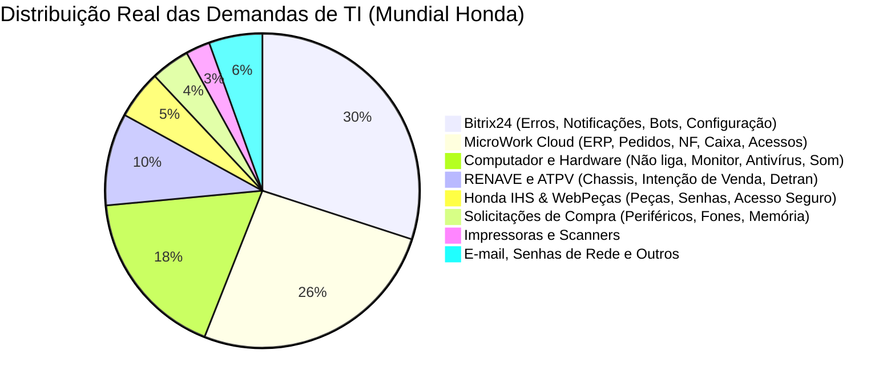
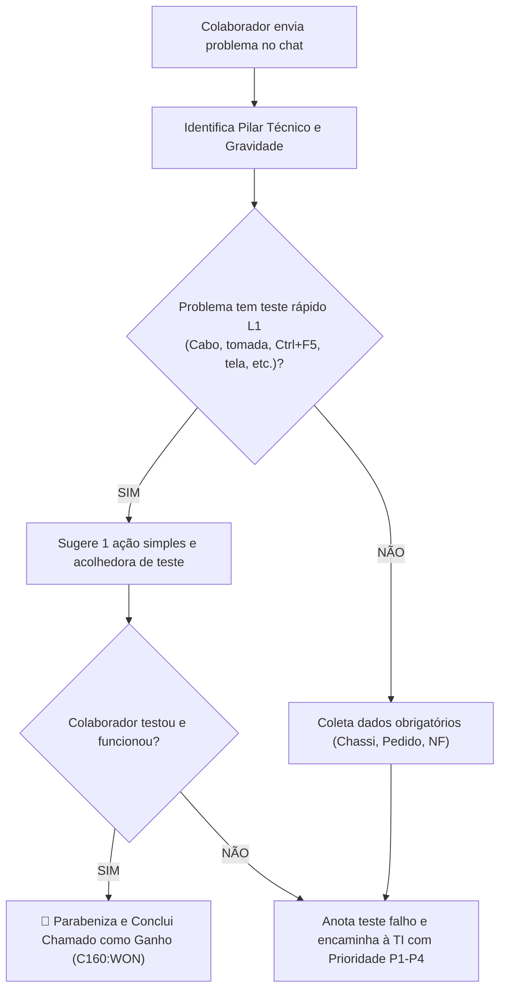

# Base de Conhecimento de Suporte de TI — Concessionárias Mundial Honda
## Playbook Oficial de Triagem e Autoatendimento Nível 1 (L1 Help Desk)

> **Baseada na Auditoria Empírica de Chamados Reais da Categoria 160 (Tickets TI - Bitrix24)**  
> **Versão:** 1.0.0 — Outubro de 2026  
> **Público:** Assistente Virtual de IA (BITRIX_TI_AI_TRIAGE_AGENT) e Equipe de TI  

---

## 1. Panorama Operacional dos Chamados Reais

A análise empírica de mais de 500 tickets abertos e encerrados revelou que **mais de 80% das demandas diárias** concentram-se em 4 grandes pilares:

---

## 2. Guia de Orientação e Autoatendimento por Pilar Técnico

### 💻 PILAR 1: COMPUTADOR, NOTEBOOK & HARDWARE (17.5% das demandas)

#### 1.1 Computador ou Notebook Não Liga / Sem Sinal de Energia
* **Sintoma Típico:** Colaborador relata *"PC do estoque não está ligando"*, *"Notebook parou de funcionar"*.
* **Orientação de Teste L1:**
  1. Verificar se o cabo de força traseiro do gabinete/fonte está firmemente plugado.
  2. Verificar se o filtro de linha/régua de tomadas está com a chave vermelha/led acesa.
  3. No caso de notebook: testar em outra tomada de parede sem o filtro e checar se o led da fonte acende.
* **Se Resolver:** Encerra como Resolvido L1 (`C160:WON`).
* **Se Não Resolver:** Conclui triagem informando à TI: `Testes L1 realizados: Tomada e cabos de força conferidos sem sinal de energia. Suspeita de fonte/hardware.`

#### 1.2 Monitor Apagado / Sem Vídeo / Tela Piscando
* **Sintoma Típico:** Gabinete liga (leds/ventoinhas ativas), mas o monitor fica escuro ou diz *"Sem Sinal"*.
* **Orientação de Teste L1:**
  1. Desconectar e reconectar com firmeza o cabo de vídeo (HDMI ou VGA) atrás do monitor e atrás do gabinete.
  2. Conferir se o botão físico de liga/desliga do monitor está aceso (luz azul ou laranja).
* **Se Não Resolver:** TI verifica se é cabo danificado ou placa de vídeo.

#### 1.3 Tela Amarela / Cores Estranhas no Monitor
* **Sintoma Típico:** *"Minha tela do PC está amarela e não volta à cor normal"*.
* **Orientação de Teste L1:**
  1. Pressionar a tecla `Windows`, digitar **"Luz Noturna"** e desativar a opção.
  2. Se persistir, reconectar o cabo VGA/HDMI (pinos tortos ou mau contato causam tom amarelado/azulado).

#### 1.4 Notificações Excessivas de Antivírus / Malwarebytes Travando a Tela
* **Sintoma Típico:** *"Malwarebytes não sai da tela"*, *"Notificação de antivírus no canto da tela atrapalhando clicar nos arquivos"*. *(Caso com mais de 8 tickets registrados!)*
* **Orientação de Teste L1:**
  1. O bot tranquiliza o usuário: a notificação indica que a proteção da Mundial está ativa.
  2. Orientar o colaborador a clicar no `X` ou recolher a notificação no painel de notificações do Windows (canto inferior direito).
  3. Se a janela estiver bloqueando cliques, solicitar o **código AnyDesk** para a TI acessar remotamente e ajustar as regras de silenciamento.

#### 1.5 Fone / Headset com Áudio Baixo no Atendimento
* **Sintoma Típico:** *"Trocamos o fone, mas ao enviar áudio a voz sai muito baixa"*.
* **Orientação de Teste L1:**
  1. Clicar com o botão direito no ícone de som perto do relógio ➔ **Configurações de som**.
  2. Em **Entrada (Microfone)**, verificar se o fone correto está selecionado e ajustar o volume de entrada para 100%.

---

### 🌐 PILAR 2: BITRIX24 & PLATAFORMAS DE COMUNICAÇÃO (30% das demandas)

#### 2.1 Mensagens Não Enviam / Chat Travado / Instabilidade
* **Sintoma Típico:** *"Não está indo as mensagens"*, *"Bitrix lento"*.
* **Orientação de Teste L1:**
  1. Pressionar **`Ctrl + F5`** no teclado para forçar recarga limpando cache local.
  2. Testar em uma aba anônima (`Ctrl + Shift + N`).
  3. Se persistir, o bot registra se a falha afeta apenas o colaborador ou a concessionária inteira.

#### 2.2 Notificações do Bitrix Não Aparecem na Tela
* **Sintoma Típico:** *"Preciso que as notificações apareçam no lado direito do computador"*.
* **Orientação de Teste L1:**
  1. No navegador (Google Chrome), clicar no ícone de cadeado/ajustes ao lado do link `b24-88dbfb.bitrix24.com.br` ➔ Ativar permissão de **Notificações**.
  2. No Windows: Configurações ➔ Sistema ➔ Notificações e Ações ➔ Ativar notificações para o navegador.

#### 2.3 IA de WhatsApp / Outras Mídias Desconectado
* **Sintoma Típico:** *"A I.A parou de responder os clientes"*, *"Outras Mídias desconectado"*.
* **Ação do Bot:** Coletar o nome do canal (ex: Sophia, Maria, Lead Loja), horário de início da falha e repassar imediatamente como **P2/Alta** para a equipe de automação.

---

### 🏢 PILAR 3: MICROWORK CLOUD (ERP) (26% das demandas)

#### 3.1 Tela Travada / Pedido de Venda ou Caixa Não Responde
* **Sintoma Típico:** *"Não estamos conseguindo fazer pedidos de venda"*, *"Travou ao faturar"*.
* **Orientação de Teste L1:**
  1. Não forçar cliques repetidos para não duplicar requisições.
  2. Fechar a aba do MicroWork Cloud e abrir novamente em uma nova guia.
  3. Coletar: Número do Pedido, Modelo da Moto / Chassi e se há mensagem de erro vermelha na tela.

#### 3.2 Erro de Integração de Nota Fiscal (Honda / Grupo / Terceiros)
* **Sintoma Típico:** *"Ao realizar integração de NFe de funcionário consta como inválido"*, *"Robô de entrada de notas parado"*.
* **Ação do Bot:** Coletar número da NF, série, loja de destino e chave de acesso da NFe para verificação nos robôs de DMS.

#### 3.3 Liberação de Acessos / Novos Usuários no MicroWork
* **Ação do Bot:** Coletar Nome completo do colaborador, CPF, Loja/Filial e Função/Módulo necessário, lembrando que precisa de aprovação do gestor do departamento.

---

### 🏍️ PILAR 4: RENAVE & ATPV (9.5% das demandas)

#### 4.1 Solicitação ou Erro ao Gerar ATPV / Intenção de Venda
* **Sintoma Típico:** *"preciso do ATPV 9C2KC2210TR134255 por favor"*, *"Solicito o ATPV da moto para documentação"*. *(Altíssima frequência de tickets com apenas o Chassi informado!)*
* **Ação Proativa do Bot:**
  1. Validar se o colaborador forneceu o **Chassi completo de 17 caracteres** (iniciado por `9C2...`).
  2. Solicitar o **Número do Pedido** no MicroWork e **Nome do Cliente**.
  3. Com esses 3 dados padronizados, a equipe de TI/Despachante conclui a emissão sem necessidade de idas e vindas de mensagens.

---

### 🖨️ PILAR 5: IMPRESSORAS & SCANNERS (2.5% das demandas)

#### 5.1 Impressora Não Imprime / Fila Presa
* **Orientação de Teste L1:**
  1. Desligar a impressora no botão físico, aguardar 10 segundos e ligar novamente.
  2. Abrir a tampa frontal e verificar se há papel atolado ou luz vermelha de tampa aberta/falha de toner.
  3. No Windows, checar se a impressora não está marcada como *"Usar impressora offline"*.

#### 5.2 Scanner Não Reconhece / Não Digitaliza
* **Orientação de Teste L1:**
  1. Verificar se o cabo USB do scanner está firme no computador (trocar de porta USB caso necessário).
  2. Fechar o aplicativo de digitalização e reabrir.

---

### 🔑 PILAR 6: HONDA IHS, WEBPEÇAS & SENHAS (5% das demandas)

#### 6.1 WebPeças Honda "Site Não Seguro" / Botões Não Abrem
* **Sintoma Típico:** *"Não consigo clicar nos campos de pesquisa do WebPeças pois aparece como site não seguro"*.
* **Orientação de Teste L1:**
  1. No Google Chrome, clicar no aviso "Não Seguro" à esquerda da URL ➔ Configurações do Site ➔ Permitir **Conteúdo Inseguro** e **Pop-ups**.
  2. Alternativamente, abrir o site pelo navegador **Microsoft Edge**.

#### 6.2 Reset de Senha de E-mail / IHS Financeiro / IHS Motos
* **Ação do Bot:** Coletar o e-mail exato (`usuario@mundialmotos.com.br`) ou login do IHS e direcionar com prioridade P3 para o administrador de senhas.

---

## 3. Diretriz Comportamental do Agente IA no Chat

### Regras de Ouro:
1. **Máximo de 1 pergunta/orientação por mensagem**: Nunca passe uma lista longa de procedimentos.
2. **Linguagem simples e não intimidadora**: Ex: *"Poderia checar se o cabinho de força atrás da CPU está bem firme?"* em vez de *"Verifique a integridade do barramento ATX"*.
3. **Se o colaborador resolver**: Registre na Timeline que o problema foi solucionado com autoatendimento e finalize o card como Ganho, liberando a fila da TI!
4. **Se o colaborador não resolver**: Registre explicitamente: *"Testes básicos realizados pelo colaborador sem sucesso"*.
